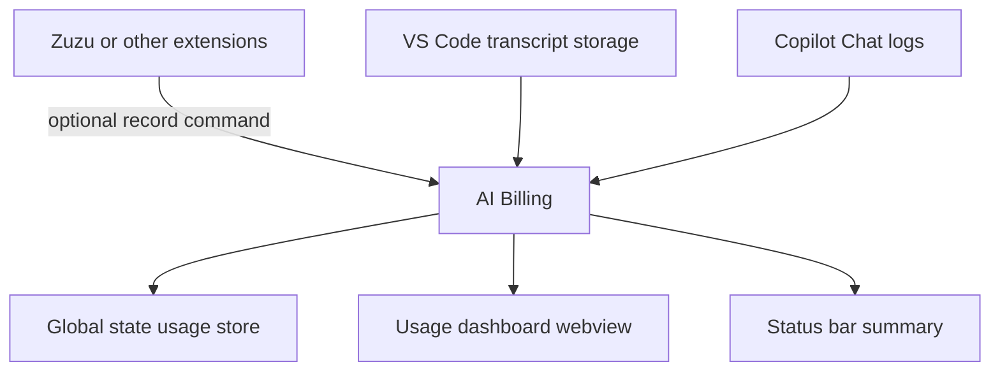

# 📑 ADR-001: Extract AI Billing into a Standalone VS Code Extension

## Table of Contents

- [Status](#status)
- [Context](#context)
- [Decision](#decision)
- [Consequences](#consequences)
- [Alternatives Considered](#alternatives-considered)
- [Implementation Notes](#implementation-notes)

## Status

Accepted.

## Context

The AI usage and billing logic originally lived alongside Zuzu, a note-taking and capture-oriented VS Code extension. That arrangement worked while billing was a narrow capability, but it introduced coupling across unrelated concerns:

- Zuzu owns note capture, command routing, and template creation.
- Billing owns usage aggregation, Copilot import, token estimation, and spend forecasting.

The implementation also needed to import data from native VS Code storage and logs, which is a distinct operational concern from Zuzu’s note workflows.

The question was whether billing should remain embedded in Zuzu or become its own extension.

## Decision

AI Billing will be maintained as a standalone VS Code extension under `_plugins/ai-billing`.

The extension will own:

- Usage record storage.
- Copilot chat import and matching.
- Token and request-unit cost calculations.
- The usage dashboard webview.
- Billing-specific configuration and commands.

Zuzu will no longer be the owning module for billing behaviour.

## Consequences

### Positive

- Clear separation of concerns between note capture and billing.
- Smaller surface area for each extension.
- Reusable billing logic for future plugins or workflows.
- Independent release cadence for billing changes.
- Easier testing and troubleshooting of local import behaviour.

### Negative

- Two extensions now need to be packaged and maintained.
- There is a modest increase in operational complexity for installation and updates.
- Cross-extension data exchange must remain intentionally minimal and explicit.

### Neutral

- The billing plugin still runs locally inside VS Code and uses the same user environment.
- The design remains extension-first rather than introducing a separate service.

## Alternatives Considered

### Keep billing inside Zuzu

Rejected because it mixes unrelated responsibilities and makes the Zuzu codebase harder to reason about.

### Introduce a shared internal library only

Rejected because the user asked for a separate plugin entity, not just a refactored module.

### Move billing to a remote service

Rejected because it would add unnecessary infrastructure, reduce privacy, and complicate the local data import flow.

## Implementation Notes

The standalone extension uses a local-first design.

The decision is intentionally conservative. It keeps billing close to the data sources, avoids remote dependencies, and preserves a clean boundary for future evolution.
