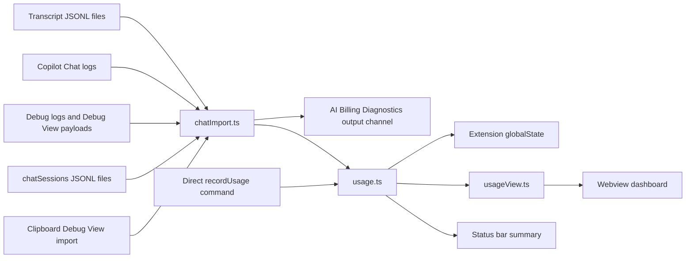
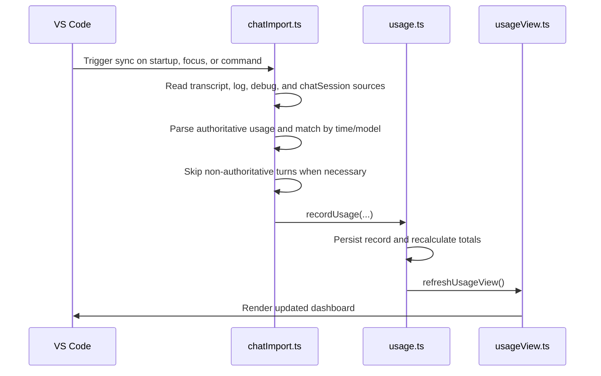

# 🏗️ AI Billing Architecture Overview

## Table of Contents

- [🏗️ AI Billing Architecture Overview](#️-ai-billing-architecture-overview)
  - [Table of Contents](#table-of-contents)
  - [Purpose](#purpose)
  - [Context](#context)
  - [System Boundaries](#system-boundaries)
    - [In scope](#in-scope)
    - [Out of scope](#out-of-scope)
  - [Core Components](#core-components)
  - [Runtime Behaviour](#runtime-behaviour)
  - [Data Flow](#data-flow)
    - [Import precedence](#import-precedence)
    - [Import sequence](#import-sequence)
  - [Storage Model](#storage-model)
  - [Billing Model](#billing-model)
  - [Reporting Model](#reporting-model)
  - [Observability](#observability)
  - [Security Considerations](#security-considerations)
  - [Extensibility](#extensibility)
  - [Operational Notes](#operational-notes)

## Purpose

This document describes the standalone AI Billing VS Code extension and the way it captures, normalises, stores, and presents AI usage data.

The extension is implemented as a local-first reporting tool for VS Code AI usage. It focuses on turning locally persisted Copilot and chat artefacts into a billing-oriented view that is easier to inspect and reconcile.

## Context

AI Billing is a local-first VS Code extension. It does not rely on a back-end service, cloud database, or remote telemetry pipeline. Instead, it reads data from the local VS Code installation, calculates cost forecasts, and stores usage records in the extension global state.

The current implementation supports two practical usage modes:

- token-derived pricing for model usage when billable token counts are available
- Copilot credit tracking when authoritative usage units are available from local sources

The design deliberately prefers authoritative local artefacts over reconstructed estimates wherever possible.

## System Boundaries

The extension boundary is intentionally narrow.

### In scope

- Importing VS Code Chat transcripts from local workspace storage.
- Reading Copilot Chat request logs from the local VS Code log directory.
- Reading Copilot `chatSessions` state files for credit and token metadata.
- Reading Debug View style usage from logs, transcript blocks, and `ccreq:*.copilotmd` virtual documents.
- Estimating spend and rendering the usage dashboard.
- Accepting direct usage ingestion from other extensions through a hidden command.
- Rebuilding and resynchronising local usage state.

### Out of scope

- Remote billing reconciliation.
- Centralised multi-device synchronisation.
- Payment processing or invoice generation.
- Modifying the source chat transcripts or log files.

## Core Components

| Component           | Responsibility                                                                                                                                   |
| :------------------ | :----------------------------------------------------------------------------------------------------------------------------------------------- |
| `src/extension.ts`  | Activates the extension, registers commands, owns the status bar, and wires UI refreshes to state changes.                                       |
| `src/chatImport.ts` | Discovers local artefacts, imports authoritative usage, matches chat turns to usage events, and persists import checkpoints and sync statistics. |
| `src/usage.ts`      | Stores usage records, resolves pricing, calculates credits and cost totals, and exposes reporting views for time windows and model comparisons.  |
| `src/usageView.ts`  | Builds the webview dashboard, including summary cards, actual-vs-forecast trend chart, sortable model table, and sortable vendor table.          |
| `src/config.ts`     | Reads user configuration for included credits, credit price, legacy request-unit settings, and diagnostics toggle.                               |
| `src/pricing.json`  | Runtime source-of-truth pricing catalogue loaded by `src/usage.ts`, with fallback handling when entries are missing.                             |

The implementation is intentionally compact. Import, storage, pricing, and presentation are separated into modules, but all persistence remains local to the extension host.

## Runtime Behaviour

At activation, the extension initialises usage storage, starts the chat importer, creates the status bar item, and registers user-facing commands.

The extension currently exposes these operational entry points:

- `aiBilling.showUsage`
- `aiBilling.syncChatUsage`
- `aiBilling.showDiagnosticsOutput`
- `aiBilling.importDebugViewFromClipboard`
- `aiBilling.clearUsage`
- `aiBilling.rebuildUsage`
- `aiBilling.recordUsage`

Import is triggered in three main ways:

- automatically on startup
- periodically every 60 seconds
- when the VS Code window regains focus

The `showUsage` and `syncChatUsage` commands also force a fresh synchronisation before presenting or refreshing results.

## Data Flow

### Import precedence

The importer now follows an authoritative-first approach.

1. `chatSessions` credit entries and token metadata when present
2. Debug View style usage entries from logs or virtual `ccreq:*.copilotmd` content
3. Debug usage embedded in transcript message content
4. Transcript token fields when explicit token counts exist

If a turn has no authoritative or explicit token data, it is skipped rather than estimated for billing-grade import.

### Import sequence

## Storage Model

Usage data is stored in extension global state using a small set of keys.

| Key                             | Purpose                                                                      |
| :------------------------------ | :--------------------------------------------------------------------------- |
| `aiBilling.usageRecords`        | Canonical imported usage records used by the dashboard and status bar.       |
| `aiBilling.chatImportedTurnIds` | Transcript turn identifiers already consumed, used to avoid double counting. |
| `aiBilling.chatImportStats`     | Last sync summary used by the dashboard subtitle.                            |

Each usage record captures:

- Timestamp
- Provider classification
- Model name
- Input and output tokens
- Cache creation and cache read tokens
- Copilot request units or credits
- Calculated cost in USD
- Optional `isAutoModel` routing flag

The importer only marks transcript turns as imported after a billing record is actually written. This prevents historical turns from being permanently lost when authoritative data is not yet available.

## Billing Model

The runtime billing model is hybrid but opinionated.

- If Copilot-reported usage units are available, they are treated as the preferred credit value.
- If only billable token counts are available, cost is derived from per-model pricing.
- If neither authoritative credits nor explicit token counts are available, the turn is not imported for billing-grade reporting.

Pricing resolution in `src/usage.ts` follows a fixed precedence:

1. User override in `aiBilling.modelPricing`
2. Model match in `src/pricing.json`
3. Built-in hard fallback pricing

For Copilot credit parsing, the implementation currently extracts:

- `copilot_usage.total_nano_aiu` from usage payloads when present
- both the displayed model name and the credit value from `chatSessions` request details strings such as `GPT-5.3-Codex • 4.0 credits`

Configuration remains backward compatible with earlier setting names such as `aiBilling.copilot.billing.monthlyIncludedRequests` and `aiBilling.copilot.billing.overageUsdPerRequest`.

## Reporting Model

The dashboard exposes multiple reporting layers:

- overall totals
- 5-hour, 7-day, and all-time windows
- 14-day daily trend with actual and forecast lines
- routing split across auto and explicit usage
- per-model routing breakdown
- per-vendor breakdown with auto/explicit credits, costs, forecast, and discount signal
- sortable model and vendor cost tables

Routing treatment is deterministic: `isAutoModel === true` is auto; all other values are treated as explicit.

## Observability

Operational diagnostics are available through an opt-in setting and a dedicated output channel.

- Setting: `aiBilling.diagnostics.enabled`
- Command: `aiBilling.showDiagnosticsOutput`
- Output channel: `AI Billing Diagnostics`

When enabled, importer logs include sync lifecycle events, source counts, skips, durations, and a per-run `syncId` correlation identifier to trace one sync from start to finish.

## Security Considerations

The architecture follows a conservative trust model:

- File access is read-only for imported transcript and log sources.
- The extension does not transmit usage data to a remote service.
- Settings are user-controlled and remain within the VS Code configuration store.
- Webview content uses a restrictive Content Security Policy and does not allow arbitrary network access.

The main residual risk is local data sensitivity. Transcript files, logs, and chatSessions may contain prompts, responses, or model metadata that should be treated as confidential.

## Extensibility

The design supports additional model providers and local import sources without changing the core persistence model.

Possible extensions include:

- Additional provider-specific pricing tables.
- Alternative importers for other local AI tooling.
- Export functions for CSV or Markdown summaries.
- A richer reporting view with monthly and quarterly breakdowns.
- More reliable routing classification when future VS Code artefacts expose explicit model-selection metadata.

The hidden `aiBilling.recordUsage` command already allows other extensions to feed usage records into the same store without coupling to the internal modules.

## Operational Notes

- The extension performs periodic syncs and a manual sync on command.
- Missing transcript or log files are handled gracefully.
- Synchronisation is guarded so only one active import runs at a time.
- Each sync run emits a correlation identifier (`syncId`) in diagnostics logs when diagnostics are enabled.
- Rebuild clears both usage records and transcript import checkpoints, then re-imports from available local history.
- Clipboard import exists as an operator tool for Debug View reconciliation when local persisted sources are incomplete.
